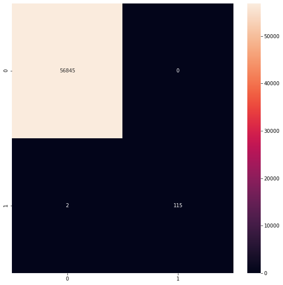
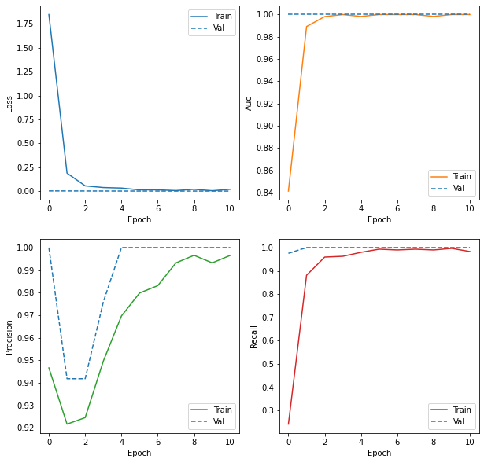

# Credit-Card-Fraud-Detection

## A Neural network model which can predict Credit Card Fraud using Transaction details.
This proejct contains data analysis of famous Credit Card Fraud dataset. Proejct was based on imbalance dataset classification. By performing some tactics to Combat Imbalanced Classes we got 99.9% accuracy.

**Classification Report :** 

                   precision    recall  f1-score   support

        False       1.00      1.00      1.00       56845
         True       1.00      0.98      0.99         117

      accuracy                          1.00       56962
     macro avg      1.00      0.99      1.00       56962 
     weighted avg   1.00      1.00      1.00       56962

**Graphs of Loss, AUC, Precision, Recall during Training:**

## Getting Started

### Dependencies

* Python 3.5–3.8
* pip 19.0 or later (requires manylinux2010 support)
* Ubuntu 16.04 or later (64-bit)
* macOS 10.12.6 (Sierra) or later (64-bit) (no GPU support)
* Windows 7 or later (64-bit)
* Microsoft Visual C++ Redistributable for Visual Studio 2015, 2017 and 2019
* GPU support requires a CUDA®-enabled card 

### Installing

* Pip install tensorflow
* Pip install keras
* Pip install seaborn
* Pip install pandas
* Pip install numpy

